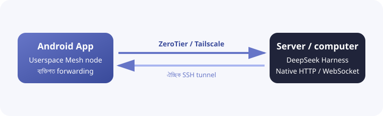

<h1 align="center">DSH Mobile Mesh</h1>

<a href="README.md">English</a> · <a href="README.zh-CN.md">中文</a> · <a href="README.hi.md">हिन्दी</a> · <a href="README.es.md">Español</a> · <a href="README.fr.md">Français</a> · <a href="README.ar.md">العربية</a> · <b>বাংলা</b> · <a href="README.pt.md">Português</a> · <a href="README.ru.md">Русский</a> · <a href="README.ur.md">اردو</a> · <a href="README.th.md">ไทย</a>

## বৈশিষ্ট্য

DSH Mobile Mesh হলো [DeepSeek Harness](https://github.com/deepseek-ai/deepseek-harness)-এর জন্য একটি অনানুষ্ঠানিক Android রিমোট। Agent, Shell, ফাইল এবং workspace DeepSeek Harness চালানো সার্ভারেই থাকে।

- Workspace, session, history এবং live reply দেখুন।
- Tool ফলাফল দেখুন এবং text, image ও file পাঠান।
- Goal, plan, approval, question, job, workflow ও subagent পরিচালনা করুন।
- Model, preset ও skill বদলান এবং DeepSeek Harness slash command চালান।

### Mesh সংযোগ

অ্যাপটি Android-এ বিল্ট-ইনভাবে ZeroTier/libzt অথবা Tailscale/tsnet userspace network চালিয়ে DeepSeek Harness-এর native HTTP/WebSocket interface ফোনে forward করে। DeepSeek Harness-এর launch mode বদলানো বা plugin ইনস্টল করা লাগে না, Android system VPN-ও প্রয়োজন হয় না। Direct, ZeroTier এবং Tailscale—তিনটির উপরই SSH forwarding যোগ করা যায়, ফলে DeepSeek Harness `127.0.0.1`-এ listen করতে পারে।

## ব্যবহার

1. সার্ভারে `dsh web` চালান।
2. ZeroTier বা Tailscale ব্যবহারের আগে DeepSeek Harness চলা সার্ভারে সংশ্লিষ্ট node install ও sign in করুন: [ZeroTier](https://www.zerotier.com/download/) install করে App-এর একই network-এ যোগ দিন, অথবা [Tailscale](https://tailscale.com/docs/install) install করে একই Tailnet-এ sign in করুন।
3. [GitHub Releases](https://github.com/sorsama/deepseek-harness-mobile/releases) থেকে APK নিন।
4. Direct, ZeroTier অথবা Tailscale বেছে নিন; SSH তিনটির জন্যই ঐচ্ছিক layer।
5. চাইলে DeepSeek Harness launch token দিন।

## নিরাপত্তা

DeepSeek Harness host-এ command চালাতে এবং file পড়তে বা লিখতে পারে। সুরক্ষাহীন port public internet-এ প্রকাশ করবেন না এবং token, SSH key ও Mesh identity সুরক্ষিত রাখুন।

## সামঞ্জস্য

পরীক্ষিত সংস্করণ: [dsh-v0.1.6-alpha.2](https://github.com/deepseek-ai/deepseek-harness/tree/dsh-v0.1.6-alpha.2), package `0.1.6-alpha.2`।

## রেফারেন্স

- [DeepSeek Harness](https://github.com/deepseek-ai/deepseek-harness)
- [OpenCode Mobile Mesh](https://github.com/chliny/opencode-mobile-mesh)
- [DeepSeek Harness Mobile](https://github.com/sorsama/deepseek-harness-mobile)

## লাইসেন্স

[MIT License](LICENSE)। DeepSeek Harness ও তার branding নিজ নিজ মালিকের সম্পত্তি।
