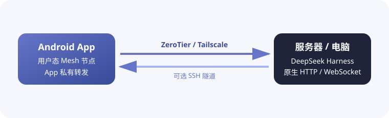

<h1 align="center">DSH Mobile Mesh</h1>

<a href="README.md">English</a> · <a href="README.zh-CN.md">中文</a> · <a href="README.hi.md">हिन्दी</a> · <b>Español</b> · <a href="README.fr.md">Français</a> · <a href="README.ar.md">العربية</a> · <a href="README.bn.md">বাংলা</a> · <a href="README.pt.md">Português</a> · <a href="README.ru.md">Русский</a> · <a href="README.ur.md">اردو</a> · <a href="README.th.md">ไทย</a>

## Características

DSH Mobile Mesh es un control remoto Android no oficial para [DeepSeek Harness](https://github.com/deepseek-ai/deepseek-harness). El Agent, Shell, los archivos y el workspace siguen ejecutándose en el servidor donde está instalado DeepSeek Harness.

- Explorar workspaces, sesiones, historial y respuestas en tiempo real.
- Ver resultados de herramientas y enviar texto, imágenes y archivos.
- Gestionar objetivos, planes, aprobaciones, preguntas, tareas, workflows y subagentes.
- Cambiar modelos, presets y skills, y ejecutar comandos slash de DeepSeek Harness.

### Conexión Mesh

La app incorpora en Android una red userspace de ZeroTier/libzt o Tailscale/tsnet y reenvía al teléfono la interfaz HTTP/WebSocket nativa de DeepSeek Harness. DeepSeek Harness no necesita cambios en su forma de inicio ni plugins, y tampoco se requiere una VPN del sistema Android. SSH puede añadirse sobre Direct, ZeroTier o Tailscale, permitiendo que DeepSeek Harness siga escuchando en `127.0.0.1`.

## Uso

1. Ejecuta `dsh web` en el servidor.
2. Antes de usar ZeroTier o Tailscale, instala e inicia sesión en el nodo correspondiente del servidor donde se ejecuta DeepSeek Harness: instala [ZeroTier](https://www.zerotier.com/download/) y únete a la misma red que la app, o instala [Tailscale](https://tailscale.com/docs/install) e inicia sesión en el mismo Tailnet.
3. Descarga el APK desde [GitHub Releases](https://github.com/sorsama/deepseek-harness-mobile/releases).
4. Elige Direct, ZeroTier o Tailscale; SSH es una capa opcional para los tres.
5. Introduce el launch token de DeepSeek Harness cuando se solicite.

## Seguridad

DeepSeek Harness puede ejecutar comandos y leer o escribir archivos en su host. No expongas un puerto sin protección a Internet y protege tokens, claves SSH y credenciales Mesh.

## Compatibilidad

Versión probada: [dsh-v0.1.5-alpha.2](https://github.com/deepseek-ai/deepseek-harness/tree/dsh-v0.1.5-alpha.2), paquete `0.1.5-rc.2`.

## Referencias

- [DeepSeek Harness](https://github.com/deepseek-ai/deepseek-harness)
- [OpenCode Mobile Mesh](https://github.com/chliny/opencode-mobile-mesh)
- [DeepSeek Harness Mobile](https://github.com/sorsama/deepseek-harness-mobile)

## Licencia

[MIT License](LICENSE). DeepSeek Harness y su marca pertenecen a sus respectivos propietarios.
