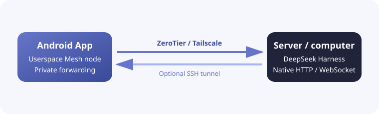

<p align="center">
  
</p>

<h1 align="center">DSH Mobile Mesh</h1>

<p align="center">
  Remote-control <b>DeepSeek Harness</b> from Android.
  <br>
  Connect through an app-private Mesh network without changing the <b>DeepSeek Harness</b> server or installing a plugin.
</p>

<p align="center">
  <b>English</b> ·
  <a href="README.zh-CN.md">中文</a> ·
  <a href="README.hi.md">हिन्दी</a> ·
  <a href="README.es.md">Español</a> ·
  <a href="README.fr.md">Français</a> ·
  <a href="README.ar.md">العربية</a> ·
  <a href="README.bn.md">বাংলা</a> ·
  <a href="README.pt.md">Português</a> ·
  <a href="README.ru.md">Русский</a> ·
  <a href="README.ur.md">اردو</a> ·
  <a href="README.th.md">ไทย</a>
</p>

<p align="center">
  
  
  <a href="LICENSE"></a>
</p>

## Features

DSH Mobile Mesh is an unofficial Android remote for [DeepSeek Harness](https://github.com/deepseek-ai/deepseek-harness). The Agent, shell, files, and workspace continue running on the computer where DeepSeek Harness is installed; the phone provides the control surface.

- Browse workspaces, sessions, and history with streaming replies.
- Inspect Markdown, reasoning, terminal, file, search, web, and diff results.
- Send text, images, and file attachments.
- Manage goals, plans, todos, approvals, user questions, jobs, workflows, and subagents.
- Select models, Agent presets, and skills, and run DeepSeek Harness slash commands.
- Search sessions, inspect trajectories and usage, export session logs, and receive completion notifications.
- Use light, dark, or system themes and the same language set as the app.

### Mesh connection

The app embeds ZeroTier/libzt or Tailscale/tsnet userspace networking on Android and forwards the native HTTP/WebSocket interface of DeepSeek Harness to the phone. DeepSeek Harness needs no launch-mode changes or plugin, and no Android system VPN is required. SSH forwarding can be layered on Direct, ZeroTier, or Tailscale, allowing DeepSeek Harness to keep listening on `127.0.0.1`.



## Usage

### 1. Start DeepSeek Harness

Start DeepSeek Harness on the server or computer using its normal command:

```bash
dsh web
```

DeepSeek Harness may keep its default `127.0.0.1:3080` listener. When using ZeroTier or Tailscale, first install and sign in to the corresponding network client on the server or computer where DeepSeek Harness runs, then make sure that node can reach DeepSeek Harness:

- [Install ZeroTier](https://www.zerotier.com/download/) and join the same ZeroTier network as the app.
- [Install Tailscale](https://tailscale.com/docs/install) and sign in to the same Tailnet as the app.

For direct Mesh access, make sure the server is reachable through the selected ZeroTier network or Tailnet.

### 2. Install the app

Download the latest APK from [GitHub Releases](https://github.com/sorsama/deepseek-harness-mobile/releases) and install it on Android. Use only the official project Release page.

### 3. Add a connection

Choose one base connection method in the app:

- **Direct**: enter an address that Android can route to the DeepSeek Harness endpoint.
- **ZeroTier**: enter the server's ZeroTier address and network ID, then authorize the network if requested.
- **Tailscale**: enter the server's Tailscale address and complete sign-in if requested.

SSH is an optional transport layer for all three methods, not a fourth method. Enter the SSH host, port, username, and password or private key. Set the remote DeepSeek Harness host to `127.0.0.1` and its port to `3080` when DeepSeek Harness is loopback-only. The app reaches SSH through Direct, ZeroTier, or Tailscale, then forwards the DeepSeek Harness connection through SSH.

Enter the DeepSeek Harness launch token when the app requests it. Saved connection settings remain in app-private storage.

## Security

DeepSeek Harness can execute commands and read or write files on its host. Any client that can access the DeepSeek Harness API has near-shell-level authority on that host.

- Prefer ZeroTier, Tailscale, or SSH instead of exposing an unprotected DeepSeek Harness port to the public internet.
- Use unencrypted LAN connections only on networks you trust.
- Protect launch tokens, SSH keys, ZeroTier Planet files, and Tailscale identity data.
- Remember that attachments are copied to the DeepSeek Harness host and can be read by the Agent.

## Compatibility

The current tested version is [dsh-v0.1.5-alpha.2](https://github.com/deepseek-ai/deepseek-harness/tree/dsh-v0.1.5-alpha.2), corresponding to package version `0.1.5-rc.2`.

## Project structure

| Path | Purpose |
|---|---|
| `androidApp/` | Android UI, connections, notifications, Mesh, and SSH forwarding |
| `core/` | DeepSeek Harness RPC, HTTP/WebSocket, streaming events, and session models |
| `shared/` | Kotlin Multiplatform shared code |
| `mock-harness/` | Test DeepSeek Harness API service |
| `tailscale/` | Tailscale tsnet userspace component |
| `third_party/libzt/` | ZeroTier libzt component |
| `scripts/` | Native and Mesh build scripts |

## References

- [DeepSeek Harness](https://github.com/deepseek-ai/deepseek-harness)
- [OpenCode Mobile Mesh](https://github.com/chliny/opencode-mobile-mesh)
- [DeepSeek Harness Mobile](https://github.com/sorsama/deepseek-harness-mobile)

## License

[MIT License](LICENSE). DeepSeek Harness and its branding belong to their respective owners; this is an independent community project.
