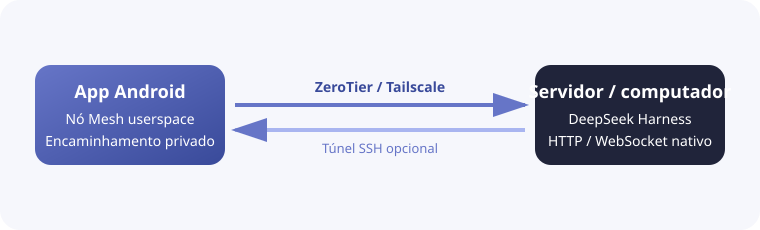

<h1 align="center">DSH Mobile Mesh</h1>

<a href="README.md">English</a> · <a href="README.zh-CN.md">中文</a> · <a href="README.hi.md">हिन्दी</a> · <a href="README.es.md">Español</a> · <a href="README.fr.md">Français</a> · <a href="README.ar.md">العربية</a> · <a href="README.bn.md">বাংলা</a> · <b>Português</b> · <a href="README.ru.md">Русский</a> · <a href="README.ur.md">اردو</a> · <a href="README.th.md">ไทย</a>

## Funcionalidades

DSH Mobile Mesh é um controle remoto Android não oficial para o [DeepSeek Harness](https://github.com/deepseek-ai/deepseek-harness). O Agent, Shell, os arquivos e o workspace continuam no servidor onde o DeepSeek Harness está instalado.

- Navegar por workspaces, sessões, histórico e respostas em tempo real.
- Ver resultados de ferramentas e enviar texto, imagens e arquivos.
- Gerenciar objetivos, planos, aprovações, perguntas, tarefas, workflows e subagentes.
- Trocar modelos, presets e skills e executar comandos slash do DeepSeek Harness.

### Conexão Mesh

O app integra no Android uma rede userspace ZeroTier/libzt ou Tailscale/tsnet e encaminha para o telefone a interface HTTP/WebSocket nativa do DeepSeek Harness. O DeepSeek Harness não precisa de alterações no modo de inicialização nem de plugins, e não é necessária uma VPN do sistema Android. SSH pode ser combinado com Direct, ZeroTier ou Tailscale, permitindo que o DeepSeek Harness continue ouvindo em `127.0.0.1`.

## Uso

1. Execute `dsh web` no servidor.
2. Antes de usar ZeroTier ou Tailscale, instale e faça login no nó correspondente do servidor onde o DeepSeek Harness está em execução: instale o [ZeroTier](https://www.zerotier.com/download/) e entre na mesma rede do app, ou instale o [Tailscale](https://tailscale.com/docs/install) e faça login no mesmo Tailnet.
3. Baixe o APK em [GitHub Releases](https://github.com/sorsama/deepseek-harness-mobile/releases).
4. Escolha Direct, ZeroTier ou Tailscale; SSH é uma camada opcional para os três.
5. Informe o launch token do DeepSeek Harness quando solicitado.

## Segurança

O DeepSeek Harness pode executar comandos e ler ou escrever arquivos no host. Não exponha uma porta sem proteção à Internet e proteja tokens, chaves SSH e dados de identidade Mesh.

## Compatibilidade

Versão testada: [dsh-v0.1.6-alpha.2](https://github.com/deepseek-ai/deepseek-harness/tree/dsh-v0.1.6-alpha.2), pacote `0.1.6-alpha.2`.

## Referências

- [DeepSeek Harness](https://github.com/deepseek-ai/deepseek-harness)
- [OpenCode Mobile Mesh](https://github.com/chliny/opencode-mobile-mesh)
- [DeepSeek Harness Mobile](https://github.com/sorsama/deepseek-harness-mobile)

## Licença

[MIT License](LICENSE). DeepSeek Harness e sua marca pertencem aos respectivos proprietários.
