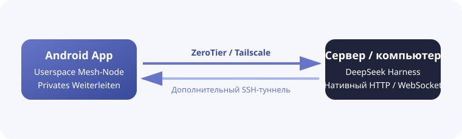

<h1 align="center">DSH Mobile Mesh</h1>

<a href="README.md">English</a> · <a href="README.zh-CN.md">中文</a> · <a href="README.hi.md">हिन्दी</a> · <a href="README.es.md">Español</a> · <a href="README.fr.md">Français</a> · <a href="README.ar.md">العربية</a> · <a href="README.bn.md">বাংলা</a> · <a href="README.pt.md">Português</a> · <b>Русский</b> · <a href="README.ur.md">اردو</a> · <a href="README.th.md">ไทย</a>

## Возможности

DSH Mobile Mesh — неофициальный Android-клиент для удалённого управления [DeepSeek Harness](https://github.com/deepseek-ai/deepseek-harness). Agent, Shell, файлы и workspace продолжают работать на сервере с установленным DeepSeek Harness.

- Просмотр workspaces, сессий, истории и потоковых ответов.
- Просмотр результатов инструментов и отправка текста, изображений и файлов.
- Управление целями, планами, подтверждениями, вопросами, задачами, workflow и субагентами.
- Выбор моделей, presets и skills, запуск slash-команд DeepSeek Harness.

### Mesh-подключение

Приложение встроенно запускает на Android userspace-сеть ZeroTier/libzt или Tailscale/tsnet и передаёт на телефон нативный HTTP/WebSocket-интерфейс DeepSeek Harness. DeepSeek Harness не требует изменения способа запуска или установки плагинов, а системный VPN Android не нужен. SSH можно добавить к Direct, ZeroTier или Tailscale, чтобы DeepSeek Harness продолжал слушать `127.0.0.1`.

## Использование

1. Запустите на сервере `dsh web`.
2. Перед использованием ZeroTier или Tailscale установите и авторизуйте соответствующий узел на сервере, где работает DeepSeek Harness: установите [ZeroTier](https://www.zerotier.com/download/) и подключитесь к той же сети, что и приложение, либо установите [Tailscale](https://tailscale.com/docs/install) и войдите в тот же Tailnet.
3. Скачайте APK из [GitHub Releases](https://github.com/sorsama/deepseek-harness-mobile/releases).
4. Выберите Direct, ZeroTier или Tailscale; SSH — дополнительный слой для всех трёх вариантов.
5. Введите launch token DeepSeek Harness по запросу.

## Безопасность

DeepSeek Harness может выполнять команды и читать или изменять файлы на хосте. Не открывайте незащищённый порт в Интернет и защищайте токены, SSH-ключи и данные Mesh.

## Совместимость

Проверенная версия: [dsh-v0.1.5-alpha.2](https://github.com/deepseek-ai/deepseek-harness/tree/dsh-v0.1.5-alpha.2), пакет `0.1.5-rc.2`.

## Ссылки

- [DeepSeek Harness](https://github.com/deepseek-ai/deepseek-harness)
- [OpenCode Mobile Mesh](https://github.com/chliny/opencode-mobile-mesh)
- [DeepSeek Harness Mobile](https://github.com/sorsama/deepseek-harness-mobile)

## Лицензия

[MIT License](LICENSE). DeepSeek Harness и его брендинг принадлежат соответствующим владельцам.
