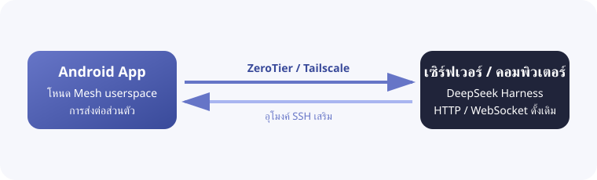

<h1 align="center">DSH Mobile Mesh</h1>

<a href="README.md">English</a> · <a href="README.zh-CN.md">中文</a> · <a href="README.hi.md">हिन्दी</a> · <a href="README.es.md">Español</a> · <a href="README.fr.md">Français</a> · <a href="README.ar.md">العربية</a> · <a href="README.bn.md">বাংলা</a> · <a href="README.pt.md">Português</a> · <a href="README.ru.md">Русский</a> · <a href="README.ur.md">اردو</a> · <b>ไทย</b>

## คุณสมบัติ

DSH Mobile Mesh คือรีโมต Android แบบไม่เป็นทางการสำหรับ [DeepSeek Harness](https://github.com/deepseek-ai/deepseek-harness) โดย Agent, Shell, ไฟล์ และ workspace ยังคงทำงานบนเซิร์ฟเวอร์ที่ติดตั้ง DeepSeek Harness

- ดู workspace, session, ประวัติ และคำตอบแบบสตรีม
- ดูผลลัพธ์ของเครื่องมือ และส่งข้อความ รูปภาพ หรือไฟล์
- จัดการ goals, plans, approvals, questions, jobs, workflows และ subagents
- เปลี่ยนโมเดล presets และ skills รวมถึงเรียกใช้ slash commands ของ DeepSeek Harness

### การเชื่อมต่อ Mesh

แอปมีเครือข่าย ZeroTier/libzt หรือ Tailscale/tsnet แบบ userspace ใน Android และส่งต่อ native HTTP/WebSocket interface ของ DeepSeek Harness ไปยังโทรศัพท์ ไม่ต้องเปลี่ยนวิธีเริ่มทำงานของ DeepSeek Harness หรือติดตั้ง plugin และไม่ต้องใช้ VPN ระดับระบบของ Android สามารถเพิ่ม SSH บน Direct, ZeroTier หรือ Tailscale ได้ ทำให้ DeepSeek Harness ยังคงรับฟังที่ `127.0.0.1`

## วิธีใช้

1. เรียกใช้ `dsh web` บนเซิร์ฟเวอร์
2. ก่อนใช้ ZeroTier หรือ Tailscale ให้ติดตั้งและลงชื่อเข้าใช้ node ที่เกี่ยวข้องบนเซิร์ฟเวอร์ซึ่งรัน DeepSeek Harness: ติดตั้ง [ZeroTier](https://www.zerotier.com/download/) และเข้าร่วม network เดียวกับแอป หรือ ติดตั้ง [Tailscale](https://tailscale.com/docs/install) และลงชื่อเข้าใช้ Tailnet เดียวกัน
3. ดาวน์โหลด APK จาก [GitHub Releases](https://github.com/sorsama/deepseek-harness-mobile/releases)
4. เลือก Direct, ZeroTier หรือ Tailscale โดย SSH เป็นชั้นเสริมสำหรับทั้งสามแบบ
5. ป้อน launch token ของ DeepSeek Harness เมื่อแอปแจ้ง

## ความปลอดภัย

DeepSeek Harness สามารถรันคำสั่งและอ่านเขียนไฟล์บนเครื่องโฮสต์ได้ อย่าเปิดพอร์ตที่ไม่มีการป้องกันสู่สาธารณะ และรักษา token, SSH key และข้อมูล Mesh ให้ปลอดภัย

## ความเข้ากันได้

เวอร์ชันที่ทดสอบแล้ว: [dsh-v0.1.5-alpha.2](https://github.com/deepseek-ai/deepseek-harness/tree/dsh-v0.1.5-alpha.2), package `0.1.5-rc.2`

## อ้างอิง

- [DeepSeek Harness](https://github.com/deepseek-ai/deepseek-harness)
- [OpenCode Mobile Mesh](https://github.com/chliny/opencode-mobile-mesh)
- [DeepSeek Harness Mobile](https://github.com/sorsama/deepseek-harness-mobile)

## ใบอนุญาต

[MIT License](LICENSE) เครื่องหมาย DeepSeek Harness เป็นของเจ้าของที่เกี่ยวข้อง
