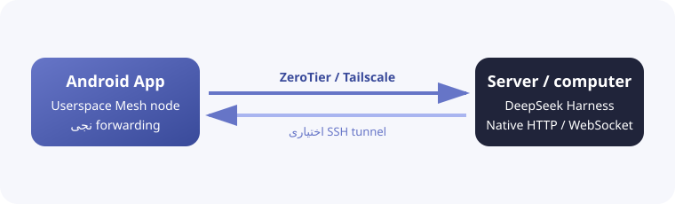

<h1 align="center">DSH Mobile Mesh</h1>

<a href="README.md">English</a> · <a href="README.zh-CN.md">中文</a> · <a href="README.hi.md">हिन्दी</a> · <a href="README.es.md">Español</a> · <a href="README.fr.md">Français</a> · <a href="README.ar.md">العربية</a> · <a href="README.bn.md">বাংলা</a> · <a href="README.pt.md">Português</a> · <a href="README.ru.md">Русский</a> · <b>اردو</b> · <a href="README.th.md">ไทย</a>

## خصوصیات

DSH Mobile Mesh، [DeepSeek Harness](https://github.com/deepseek-ai/deepseek-harness) کے لیے ایک غیر سرکاری Android ریموٹ ہے۔ Agent، Shell، فائلیں اور workspace اسی سرور پر چلتے ہیں جہاں DeepSeek Harness نصب ہے۔

- Workspaces، sessions، history اور live replies دیکھیں۔
- Tool نتائج دیکھیں اور text، images اور files بھیجیں۔
- Goals، plans، approvals، questions، jobs، workflows اور subagents سنبھالیں۔
- Models، presets اور skills تبدیل کریں اور DeepSeek Harness slash commands چلائیں۔

### Mesh کنکشن

ایپ Android میں ZeroTier/libzt یا Tailscale/tsnet userspace network بلٹ اِن چلاتی ہے اور DeepSeek Harness کے native HTTP/WebSocket interface کو فون پر forward کرتی ہے۔ DeepSeek Harness کے launch mode میں تبدیلی یا plugin کی ضرورت نہیں، اور Android system VPN بھی ضروری نہیں۔ SSH کو Direct، ZeroTier یا Tailscale تینوں کے ساتھ شامل کیا جا سکتا ہے، جس سے DeepSeek Harness `127.0.0.1` پر سن سکتا ہے۔

## استعمال

1. سرور پر `dsh web` چلائیں۔
2. ZeroTier یا Tailscale استعمال کرنے سے پہلے DeepSeek Harness والے سرور پر متعلقہ node انسٹال اور sign in کریں: [ZeroTier](https://www.zerotier.com/download/) انسٹال کرکے App والے network سے جڑیں، یا [Tailscale](https://tailscale.com/docs/install) انسٹال کرکے اسی Tailnet میں sign in کریں۔
3. [GitHub Releases](https://github.com/sorsama/deepseek-harness-mobile/releases) سے APK ڈاؤن لوڈ کریں۔
4. Direct، ZeroTier یا Tailscale منتخب کریں؛ SSH تینوں کے لیے اختیاری layer ہے۔
5. ضرورت پر DeepSeek Harness launch token درج کریں۔

## سیکیورٹی

DeepSeek Harness host پر commands چلا اور files پڑھ یا لکھ سکتا ہے۔ غیر محفوظ port کو public internet پر نہ کھولیں اور tokens، SSH keys اور Mesh identity محفوظ رکھیں۔

## مطابقت

آزمودہ ورژن: [dsh-v0.1.5-alpha.2](https://github.com/deepseek-ai/deepseek-harness/tree/dsh-v0.1.5-alpha.2)، package `0.1.5-rc.2`۔

## حوالہ جات

- [DeepSeek Harness](https://github.com/deepseek-ai/deepseek-harness)
- [OpenCode Mobile Mesh](https://github.com/chliny/opencode-mobile-mesh)
- [DeepSeek Harness Mobile](https://github.com/sorsama/deepseek-harness-mobile)

## لائسنس

[MIT License](LICENSE)۔ DeepSeek Harness اور اس کی branding متعلقہ مالکان کی ملکیت ہیں۔
